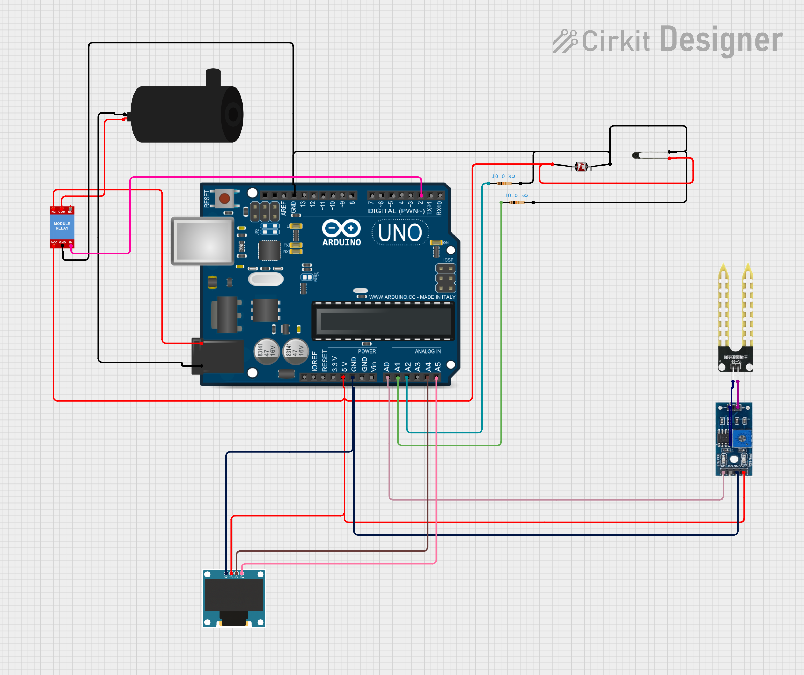

# 🌱 Smart Pot
<a>
  
</a>

<p align="center">
  
  
  
  
</p>

---

# 📖 Overview
- Fully Customisable
- Waters Automatically (According to Requirement)
- Displays Important Parameters

---

# ✨ Features
- Automatic plant watering based on soil moisture
- Real-time display of soil moisture & temperature
- Configurable watering thresholds
- Compact and energy efficient

---

# 🛠 Requirements
- Arduino Nano / Uno / Mega
- OLED Display I2C 0.96"
- Capacitive Soil Moisture Sensor
- 10K NTC Thermistor
- 2 × 10K Resistors
- 5V Relay Module
- 5V DC Water Pump
- Connecting wires

---

# 🔌 Circuit Diagram

> [!IMPORTANT]  
> **Arduino UNO:** A4 (SDA), A5 (SCL)

> [!IMPORTANT]  
> **Arduino MEGA 2560:** 20 (SDA), 21 (SCL)

> [!IMPORTANT]  
> **Arduino LEONARDO:** 2 (SDA), 3 (SCL)

[](https://app.cirkitdesigner.com/project/f46325be-b6d5-4208-ba56-927e1e49a3c9?view=interactive_preview)

---

# 🚀 Setup
1. Clone this repository:
   ```bash
   git clone https://github.com/elmarcsalvador/smart-pot.git
   cd smart-pot
   ```
2. Open the Arduino IDE.
3. Select your board (Nano / Uno / Mega).
4. Install the required libraries:
   - Adafruit SSD1306
   - Adafruit GFX
6. Upload the sketch to your board.

---

# 📖 Usage
* Place the soil moisture sensor in the pot.
* The OLED will display:
  - Soil moisture level
  - Temperature
  - Pump status
* The pump will automatically water the plant when moisture drops below the set threshold.

---

# 🔮 Future Plans
- [ ] Mobile app integration
- [ ] Battery-powered version

---

# 🤝 Contributing
Contributions are welcome! Feel free to fork this repo and submit a pull request.

---

# 📜 License
This project is licensed under the MIT License.
